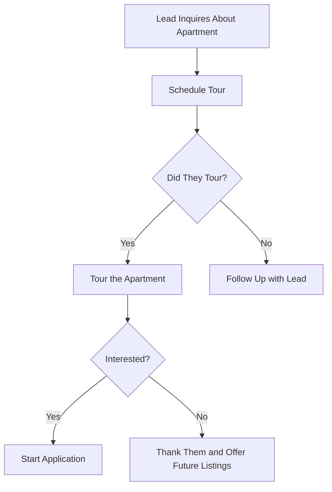

# Tour-to-Lease Flowchart

This diagram shows the leasing process for an apartment community, from lead inquiry to application.

Entity Descriptions

Lead Inquires About Apartment: This is the starting point where a potential resident expresses interest in an apartment, typically through an online form, phone call, or walk-in inquiry.
Schedule Tour: The leasing team contacts the lead to schedule a tour of the apartment at a convenient time.
Did They Tour?: This decision point checks if the lead actually showed up for their scheduled tour.
Tour the Apartment: If the lead attends, they are shown the apartment and amenities by the leasing agent.
Follow Up with Lead: If the lead no-shows, the leasing team reaches out to reschedule or answer any questions.
Interested?: After the tour, the leasing agent gauges whether the lead is interested in moving forward.
Start Application: If the lead is interested, they begin the rental application process either online or in person.
Thank Them and Offer Future Listings: If not interested, the agent thanks them for their time and adds them to a follow-up list for future availability.

