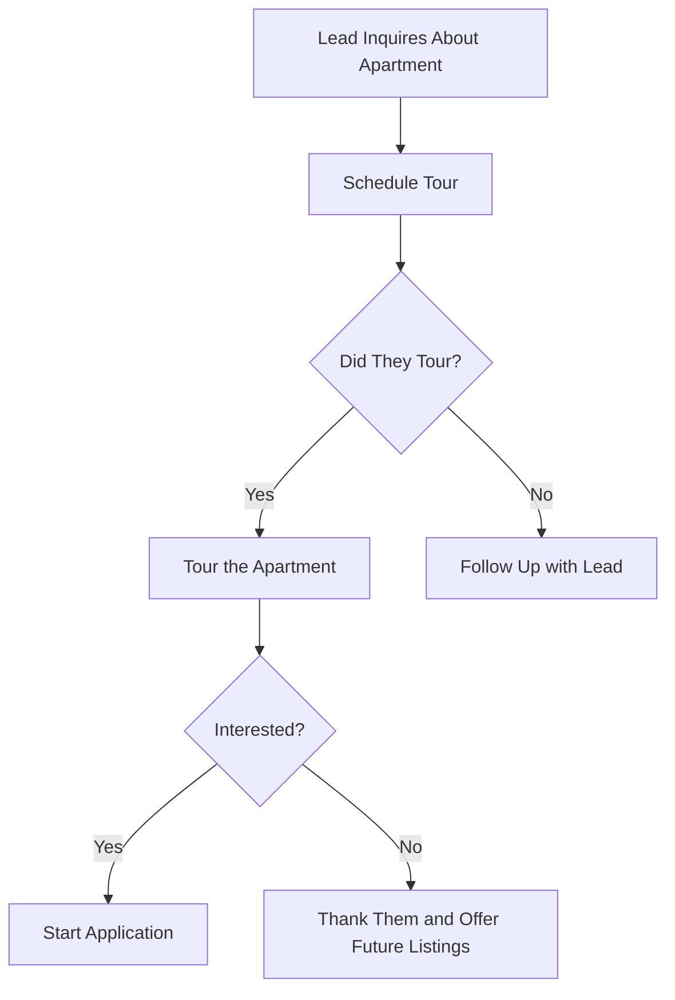

# Tour-to-Lease Flowchart

This diagram shows the leasing process for an apartment community, from lead inquiry to application.

```mermaid
flowchart TD
    A[Lead Inquires About Apartment] --> B[Schedule Tour]
    B --> C{Did They Tour?}
    C -- Yes --> D[Tour the Apartment]
    C -- No --> E[Follow Up with Lead]
    D --> F{Interested?}
    F -- Yes --> G[Start Application]
    F -- No --> H[Thank Them and Offer Future Listings]
```
